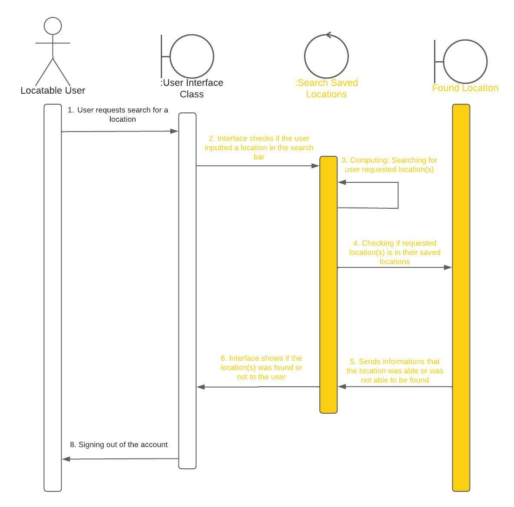
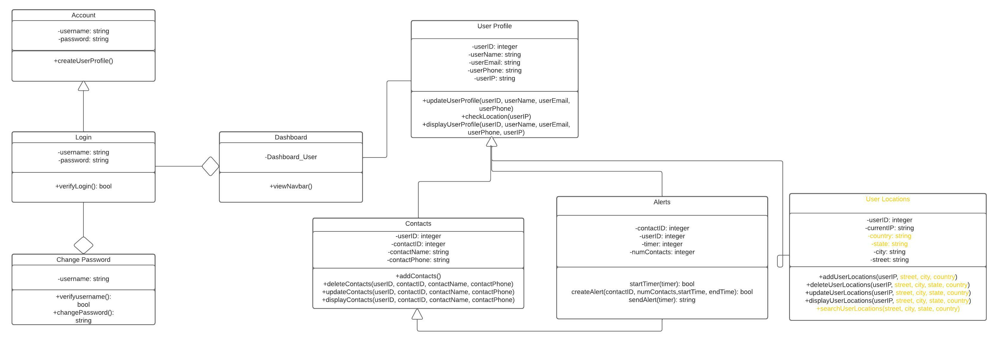
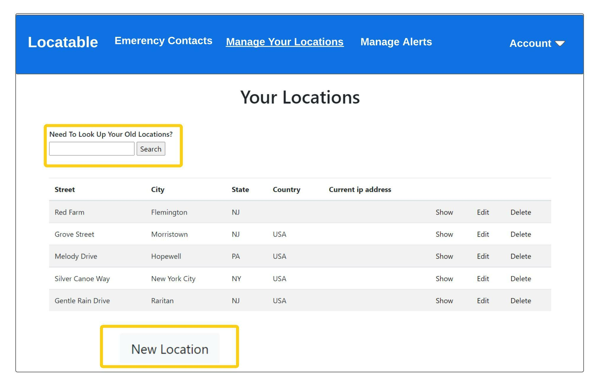

# Project Name: Locatable

Locatable is a web application that focuses on ensureing everyone has access to one of our many basic human rights, saftey. Having a complete free web application that can allow users to send alerts and their location when they are in possible danger. 

## What is Locatable? 
* [Learn More About Locatable](docs/what_is_locatableREADME.md)

## Final Exam Changes

### Instructions to run new search location functionality

#### Steps to use the new feature
##### Getting into VM
* Run ssh student1@csc415-server16.hpc.tcnj.edu
* Password: HelloWorld123!
##### Project Path
* cd vm-csc415/Assignment_2_Locatable/src
##### Correct if you are in the right branch
* git branch
* The branch with the '*' symbol is the current branch the VM is using.
* If the returned result is not ‘*final-exam’, enter: git checkout final-exam
##### Running the web application 
* rails server --binding=10.18.6.16 
##### Once web application is running, open the web application in a browser
* http://csc415-server16.hpc.tcnj.edu:3000
* Login
  1) Email: user@example.com
  2) Password: password
##### Where is the search location functionality?
* In the nav bar click on Manage Your Locations
* Or  http://csc415-server16.hpc.tcnj.edu:3000/user_locations
##### Testing the search location functionality
* The search bar can be seen in the left hand corner of this page
* Search for the full street, or city, state, or country. 
  1) The search is case sensitive
  2) It only shows the first instance of a certain location if some locations show a common field such as country
  3) To refresh the search, click on the Manage Your Locations link in the nav bar
##### Improvements for the Future: Github Issues
###### Functional Requirement 
* [Issue #17](https://github.com/nallurn1/Assignment_2_Locatable/issues/17)
* [Issue #18](https://github.com/nallurn1/Assignment_2_Locatable/issues/18)
###### Non-Funcational Requiment 
* [Issue #16](https://github.com/nallurn1/Assignment_2_Locatable/issues/16)

### Updated Diagrams For Final Exam
* Note: Please click on the diagram to enlarge the image
#### System Sequence Diagram:

#### Design Class Diagram:

#### Mock-Up:

## Installation Instructions
Please see the guides below for instructions on how to set up an SSH key and clone this repository:
* [Installation Guide](docs/Installation_Guide.md)
* [Setting up SSH keys with GitHub](docs/Setting_up_SSH_keys_GitHub.md)
* [More helpful information](docs/More_helpful_info.md)
