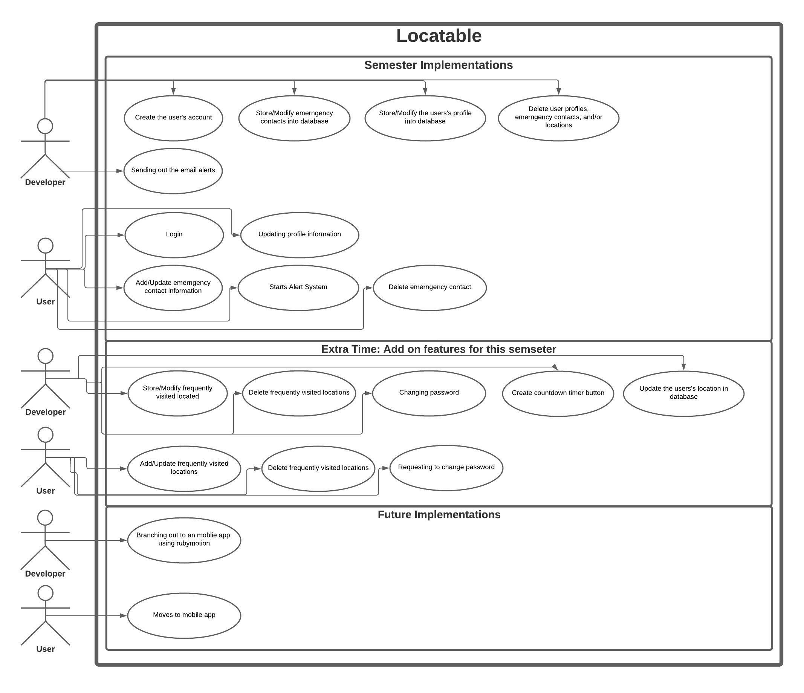
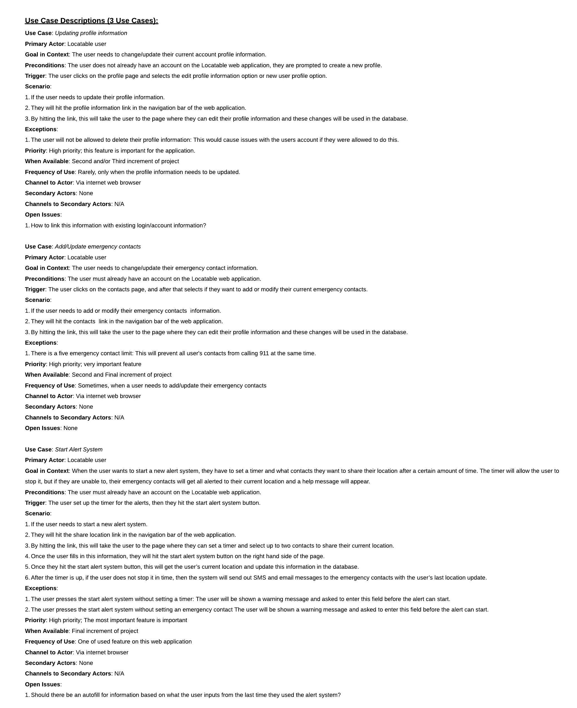
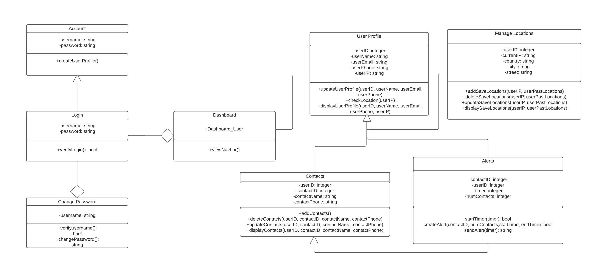
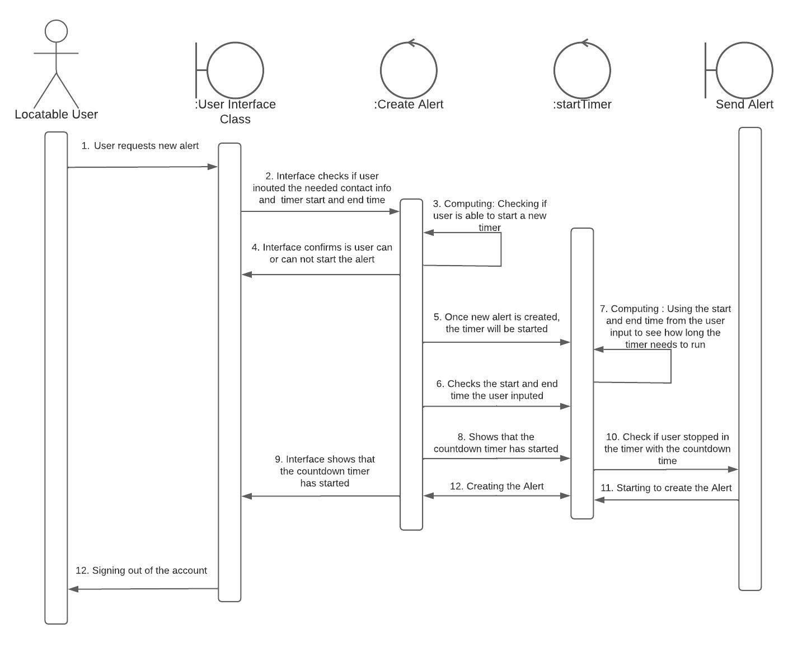
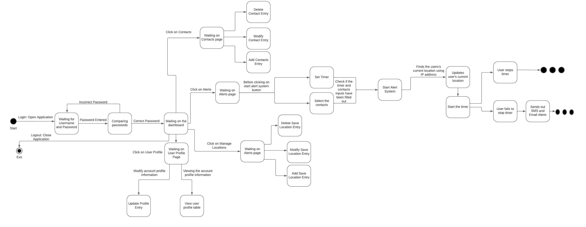

# Project Name: Locatable

***

## Problem Statement:
How to ensure one's safety through a web application in a free and secure manner. 

***

## Objectives:
A web-based application that allows the user to send their location to their emergency contacts and this sends an SMS and email notification.

## Why is this solution innovative?

This problem is innovative because it offers older users the privacy they need instead of using the locator  app where parental unit/emergency contacts will not 
know your very step, this offers people a way to let their emergency contact if they feel a bit unsafe and uncertain of their safety they can get an alert sent out. 
The current apps out in the market, whether they are mobile and or web-based apps, they have features of alerting the user’s emergency contacts about where they 
are at all times, or to get help from local authorities, however many of these features cost money and are required for some sort of monthly subscription. Safety is 
a basic human right,no one should be afraid of not being able to go back home, and for that reason the Locatable web-based app will be free to its users
carfully handle all the user's sensitive information.

***
## Instructions for Installation:
* [Instructions](instructions_README.md)

## Opensource Maintenance Rules:
#### Rule 1: What is not helpful opensource contributions 
* Avoid making very superfical changes such as editing to the comments without any real changes to the code 

#### Rule 2: Documentation and Bugs/Issues 
* Create a well documented README.md in the docs folder with all the details on all the new features added to this project linked in the README.md file
    * Add in any bugs and issues that can not be resolved should be included in your README.mb and in issues page on github

#### Rule 3: Create your own branch of the orginal project in the main branch
* Create your branch of this project and make sure it is a clone of the main branch
   * After you are done with your contrubitions create a pull request before merging to main. This way the admin can review and confirm if the changes are good and      have no errors. 

#### Rule 4: Code and File(s) Quality
  * The code must be efficient, secure and maintainable
  * The code must be well commmented/documented and explains the functionilities of the web application
  * The code should have error handeling and validation checks of the users input when needed

***

## How to do Opensource Work on Locatable?
* [Learn More About Opensource](openSourceREADME.md)

***

## UML Diagrams and Other Diagrams for Prototype 3

#### Use Case for the project:

#### Use Case Descriptions for the project:

#### Design Class Diagram for the project:

#### System Sequence Diagram for the project:

#### State Chart for the project:

